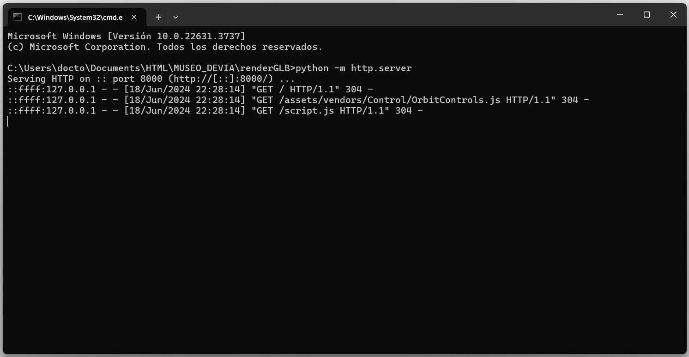
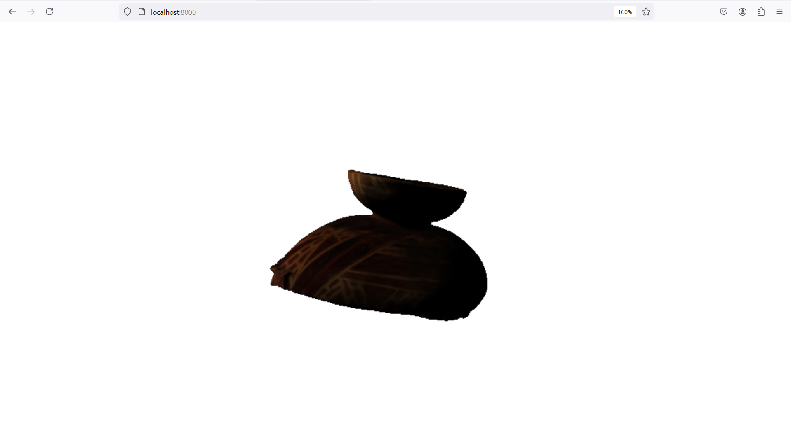

<h1 align="center"> FelipedelosH </h1>
 
<h4>RENDER .glb 3D figure only JavaScript</h4>

 
:construction: v1.0 :construction:
 
https://felipedelosh.github.io/Render3DGLB/
 

## :hammer:Funtions:

- `Function 1`: render models\model.glb. 
- `Function 2`: Mouve the shape with mouse or touchpad 

## :play_or_pause_button:How to execute a project

OPEN A CMD promt
 
python -m http.server
 
OPEN your web broswer and enter: http://localhost:8000/

## :hammer_and_wrench:Tech.

- HTML
- JavaScript
- three.js
- GLTFLoader.js
- OrbitControls.js

## :warning:Warning.

- YOU NOT SEE IT if only open "index.html"
 
Exists a CORPS and don't permit open a external files outside the server, you need install python and create local server to watch it.
 
You need a server to show.

1. Install python
2. Open terminal and RUN: python -m http.server 
3. Open http://localhost:8000/  

## Autor

| [ Andrés Felipe Hernánez](https://github.com/felipedelosh)|
| :---: |